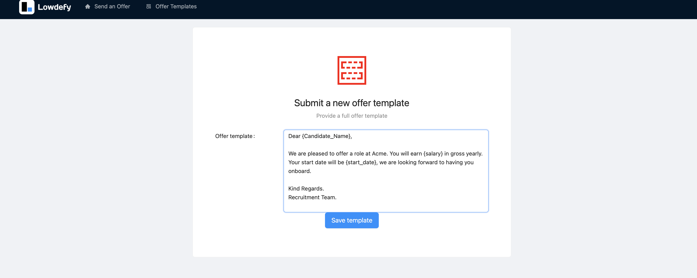
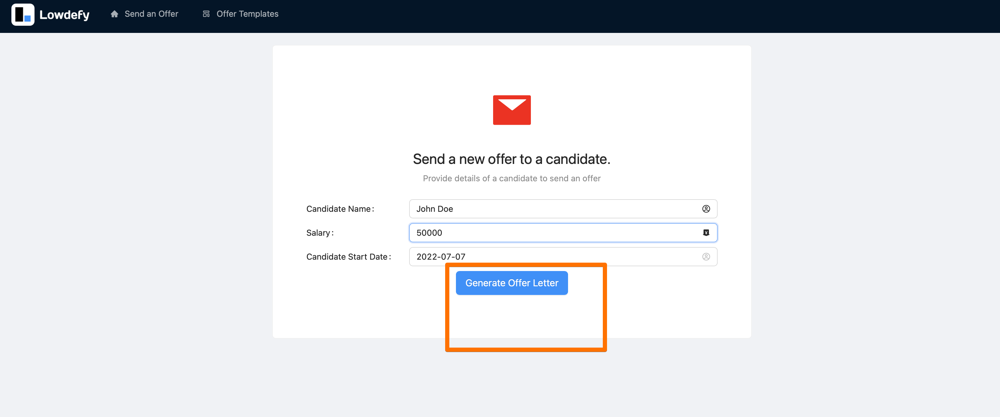

# Lowdefy Low Code Offer Letter Generator

This is a sample project to try Lowdefy for implementing a offer letter generator. The sample UI has two features.
Lowdefy is a Low-Code platform that removes all the complicated parts of developing a web app as internal tools. A perfect match for a recruiter developing 
an internal tool. https://github.com/lowdefy

1.Get a template as an input from the users.

2.Generate an offer letter by providing values to the template variables.

## Getting Started

To be able to develop this project further you will need.

- Node 12+

The project is based on latest lowdefy v4 version. After checkout, please run

`npx lowdefy@4.0.0-alpha.18 dev`

You will see the homepage...

All the logic starts from `lowdefy.yaml` file which only has simple configurations not single line of code.